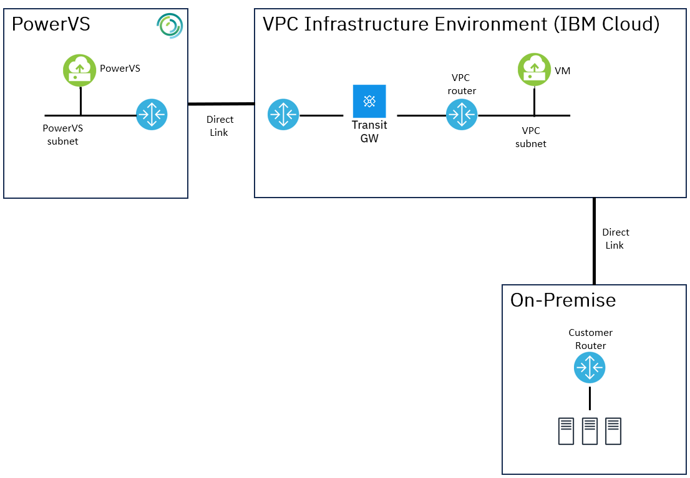
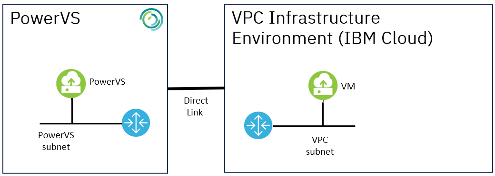

---

copyright:
  years: 2023
lastupdated: "2023-11-28"

subcollection: pattern-oracle-rac-on-powervs

keywords:

---

{{site.data.keyword.attribute-definition-list}}

# Pattern Overview

The objective of this pattern is to provide a solution design for an [Oracle RAC](https://www.oracle.com/database/real-application-clusters/) Database deployment on [IBM Power Systems Virtual Server (PowerVS)](https://www.ibm.com/products/power-virtual-server) that meets high availability requirements for enterprise workloads. This pattern is intended to:

-   Accelerate and simplify solution design by providing a standard IBM PowerVS deployment architecture reference following the IBM Architecture Framework

-   Provide a prescriptive, end-to-end enterprise-class solution design, with diagrams, component architecture decisions along with a rationale for cloud component selection to meet enterprise requirements

-   Design a solution to meet performance, system availability and security needs

-   Focused on PowerVS (AIX) with IBM Cloud VPC

**Note:** As new features and products are made available such as Power 10 systems, Power Edge Router (PER), Monitoring and Logging enhancements, this document will be refreshed.

Oracle RAC on IBM Power Systems Virtual Server (PowerVS) pattern allows customers to run a single Oracle Database across multiple servers/multiple virtual machines in a single zone, in order to maximize availability and enable horizontal scalability, while accessing shared storage. User sessions connecting to Oracle RAC instances can failover without any changes to end user applications.

The IBM Power Systems Virtual Server environment consists of SAN Storage, Power Systems servers, PowerVM Hypervisor, and AIX Operating Systems that are certified for Oracle DB (12c, 18c, 19c) including RAC. IBM PowerVS meets the current requirements of a certified and supported stack. Oracle RAC on IBM PowerVS is a supported configuration.

PowerVS is a fully contained, standalone offering and has its own management control plane. PowerVS is co-located with IBM Cloud Infrastructure with separate networks and direct-attached storage. The environment is in its own pod and the internal networks are fenced but offer connectivity options to IBM Cloud infrastructure or on-premises environments to meet customer requirements. PowerVS provides a simple and easy interface for creating shared storage and network resources required for Oracle RAC implementation. The implementation requires shared storage between the cluster nodes, and public and private networks for RAC communication between the nodes. These PowerVS connectivity options allow instances to easily integrate with IBM Cloud Services such as the Identity and Access Management (IAM) service to securely authenticate users, control access to PowerVS resources with resource groups, and allow access to specific resources for a set of users with access groups, and the Cloud Object Storage (COS) service to store backups.

Following the Architecture Framework, the Oracle RAC on PowerVS covers design considerations for the following aspects and domains:

-   **Compute:** Power Systems Virtual Servers

-   **Storage:** Primary Storage, Backup Storage

-   **Networking:** Enterprise Connectivity, Segmentation, Cloud Native Connectivity, DNS

-   **Security:** Data Security, Application Security, Infrastructure Security

-   **Resiliency:** Backup and Restore, High Availability, Disaster Recovery

-   **Observability:** Monitoring, Logging, Auditing

The Architecture Framework provides a consistent approach to design cloud solutions by addressing requirements across a set of "aspects" and "domains", which are technology-agnostic architectural areas that need to be considered for any enterprise solution. See [Introduction to the Architecture Framework](https://cloud.ibm.com/docs/architecture-framework?topic=architecture-framework-intro) for more details.

# Pattern Requirements

The following represents a baseline set of requirements which are applicable to most clients and critical to successful Oracle RAC on PowerVS deployment.

| **Aspects**                     | **Description of the requirement**                                                                                                                                                                                                     |
|---------------------------------|----------------------------------------------------------------------------------------------------------------------------------------------------------------------------------------------------------------------------------------|
| **Compute Requirements**        | Provide different levels of cpu and memory options to match the type of workloads                                                                                                                                                      |
| **Storage Requirements**        | Provide different storage Tier level for type of workloads                                                                                                                                                                             |
| **Network Requirements**        | Enterprise connectivity to customer data center(s) to provide access to applications from on-prem                                                                                                                                      |
|                                 | Provide network isolation with the ability to segregate applications based on attributes such as data classification, public vs internal apps and function                                                                             |
|                                 | Maintain IP addresses in the target (BYOIP)                                                                                                                                                                                            |
| **Security Requirements**       | Provide data encryption at rest                                                                                                                                                                                                        |
|                                 | IDS/IAM Services to target IBM PowerVS environment                                                                                                                                                                                     |
|                                 | Firewalls must be restrictively configured to provide advanced security features and prevent all traffic, both inbound and outbound, except that which is specifically required, documented, and approved and include IPS/IDS services |
| **Resiliency Requirements**     | Multi-Region capability to support disaster recovery strategy and solution that allows all production applications to be included leveraging cloud infrastructure DR capabilities                                                      |
|                                 | RTO/RPO = 4 hours/15 minutes; rollback to original environments should occur no later than specified RTOs                                                                                                                              |
|                                 | Provide backup for Infrastructure components and Database hosted in the cloud environment.                                                                                                                                             |
| **Observability Requirements**  | Provide Health and System Monitoring with ability to monitor and correlate performance metrics and events and provide alerting across applications and infrastructure                                                                  |
|                                 | Ability to diagnose issues and exceptions and identify error source                                                                                                                                                                    |
|                                 | Automate management processes to keep applications and infrastructure secure, up to date, and available                                                                                                                                |
| **Other Requirements**          | Migrate workloads from existing data center to IBM PowerVS                                                                                                                                                                             |

# Solution Architecture - Oracle RAC on IBM PowerVS

A reference architecture for Oracle RAC, High Availability, in a single zone region, represents a particular solution, based on best practices and use-cases.

The architecture below (section 4.1) lists a reference solution which has Power Virtual server environment and IBM Cloud VPC with the following components.

A Single Zone Region:

-   VPC environment

    -   Edge VPC: This landing zone hosts key security solution components needed in VPC and cloud management

    -   Management VPC: This landing zone hosts all the management stack needed to manage VPC and PowerVS environment

-   PowerVS Environment

    -   Workload PowerVS cluster: Oracle RAC

Here are the solution component details

1.  PowerVS systems are created in a PowerVS workspace. This workspace acts as a container for all PowerVS instances at a specific geographic region

2.  For each Power Systems Virtual Server instance, a storage tier (Tier 1 or Tier 3) is selected. The storage tiers in Power Systems Virtual Server are based on I/O operations per second (IOPS)

3.  The client network connectivity is accomplished from on-premise to IBM Cloud and PowerVS is setup through Direct Link (2.0) and Transit Gateway

4.  An edge VPC is deployed which contains routing and security function. It contains Bastion host, Firewalls providing advanced security functions

5.  Managed VPC provides access to compute, storage, and network services to enable the application provider's administrators to monitor, operate, and maintain the environment. The intent is to completely isolate management operations from the VPC running consumer workloads

6.  Public connectivity also routes through Cloud Internet services which can provide load balancing, failover, and DDoS services, then routes to the edge VPC

7.  Virtual Private endpoints are used to provide connectivity to cloud native services from each VPC

8.  Direct Link (2.0) and Transit Gateway is used to connect PowerVS environment the core workload hosting the Oracle RAC application and database(s) to a management VPC where various management tools can be deployed

9.  Get visibility into the performance and health of your resources by configuring the [monitoring](https://cloud.ibm.com/docs/power-iaas?topic=power-iaas-monitor-sysdig#sysdig-view-ui) and [activity tracker](https://cloud.ibm.com/docs/power-iaas?topic=power-iaas-at-events), observability components

## Solution Architecture

## Solution Components

| **Aspects**       | **Solution Components**                                                                                                                    | **How it is used in solution**                                                                                    |
|-------------------|--------------------------------------------------------------------------------------------------------------------------------------------|-------------------------------------------------------------------------------------------------------------------|
| **Compute**       | [PowerVS](https://cloud.ibm.com/docs/power-iaas?topic=power-iaas-getting-started)                                                          | Web, App, and database servers                                                                                    |
| **Storage**       | [PowerVS Storage](https://cloud.ibm.com/docs/openshift?topic=openshift-vpc-block)                                                          | Database servers shared storage for RAC                                                                           |
|                   | [VPC Block Storage](https://cloud.ibm.com/docs/vpc?topic=vpc-block-storage-about&interface=ui#block-storage-overview)                      | Web app storage if needed                                                                                         |
|                   | [VPC File Storage](https://cloud.ibm.com/docs/vpc?topic=vpc-file-storage-vpc-about&interface=ui)                                           | Web app shared storage if needed                                                                                  |
|                   | [Cloud Object Storage](https://cloud.ibm.com/docs/cloud-object-storage?topic=cloud-object-storage-getting-started-cloud-object-storage)    | Web app static content, backups, logs for short and long-term retention (application, operational and audit logs) |
| **Networking**    | [VPC Virtual Private Network (VPN)](https://cloud.ibm.com/docs/iaas-vpn?topic=iaas-vpn-getting-started)                                    | Remote access to manage resources in private network                                                              |
|                   | [Virtual Private Gateway & Virtual Private Endpoint (VPE)](https://cloud.ibm.com/docs/vpc?topic=vpc-about-vpe)                             | For private network access to Cloud Services, e.g., Key Protect, COS, etc.                                        |
|                   | [VPC Load Balancers](https://cloud.ibm.com/docs/vpc?topic=vpc-load-balancers)                                                              | Application Load Balancing for web servers, app servers, and database servers                                     |
|                   | [Public Gateway](https://cloud.ibm.com/docs/vpc?topic=vpc-about-public-gateways&interface=ui)                                              | For web server access to the internet                                                                             |
|                   | [Cloud Internet Services (CIS)](https://cloud.ibm.com/docs/cis?topic=cis-getting-started)                                                  | Public Load balancing of web servers traffic across zones in the region                                           |
|                   | [DNS Services](https://cloud.ibm.com/docs/dns-svcs?topic=dns-svcs-about-dns-services)                                                      | Domain Name System (DNS) to associate human-friendly domain names with IP addresses                               |
| **Security**      | [IAM](https://cloud.ibm.com/docs/account?topic=account-cloudaccess)                                                                        | IBM Cloud Identity & Access Management                                                                            |
|                   | [BYO Bastion Host on VPC VSI](https://cloud.ibm.com/docs/solution-tutorials?topic=solution-tutorials-vpc-secure-management-bastion-server) | Remote access with Privileged Access Management                                                                   |
|                   | [Virtual Private Clouds (VPCs), Subnets, Security Groups, ACLs](https://cloud.ibm.com/docs/vpc?topic=vpc-getting-started)                  | Core Network Protection for web, app, and database tiers                                                          |
|                   | [Cloud Internet Services (CIS)](https://cloud.ibm.com/docs/cis?topic=cis-getting-started)                                                  | DDoS protection and Web App Firewall                                                                              |
|                   | [Key protect](https://cloud.ibm.com/docs/key-protect) or [HPCS](https://cloud.ibm.com/docs/hs-crypto?topic=hs-crypto-get-started)          | Hardware security module (HSM) and Key Management Service                                                         |
|                   | [Secrets Manager](https://cloud.ibm.com/docs/secrets-manager)                                                                              | Certificate and Secrets Management                                                                                |
| **Resiliency**    | [PowerVS](https://cloud.ibm.com/docs/power-iaas?topic=power-iaas-getting-started)                                                          | Multiple PowerVS on separate physical servers with VM and Storage anti-affinity policy                            |
| **Observability** | [IBM Cloud Monitoring](https://cloud.ibm.com/docs/monitoring?topic=monitoring-about-monitor)                                               | Apps and operational monitoring                                                                                   |
|                   | [IBM Log Analysis](https://cloud.ibm.com/docs/log-analysis?topic=log-analysis-getting-started)                                             | Apps and operational logs                                                                                         |
|                   | [Activity Tracker Event Routing](https://cloud.ibm.com/docs/atracker?topic=atracker-about)                                                 | Audit logs                                                                                                        |

# Compute

## Compute Considerations

Power Virtual Servers are available with flexible hardware configurations on both Power S922 and E980. It is permitted to define a custom size of the IBM Power Virtual Server to use for Oracle RAC

The Flexibility of IBM Power Systems Virtual Servers capability includes:

• Cores (CPU)

• Memory (RAM)

• Data volume size / volume type / performance tier

• Network interfaces (Public / Private)

• PowerVM Host Pinning Policy (soft or hard)

• PowerVM Host CPU Binding (dedicated or shared)

• Reserved Capacity via Shared Processor Pool Option
Note: For details on capabilities, check [here](https://cloud.ibm.com/docs/power-iaas?topic=power-iaas-creating-power-virtual-server#creating-power-virtual-server)

For Oracle RAC, it is recommended to provision at least 2 nodes in a single zone on two separate physical servers using placement group for High Availability of production workload. Deviation from this setup can cause latency. Databases typically experience growth over time so database size and expected data growth rates should be taken into consideration when planning database deployments although there is the capability to extend storage capacity/volume size extension or add new shared volumes to the database.

-   For Oracle RAC workloads which require less than 12 cores and 950GB of memory select S922 system. S922 system CPU capacity ranges 0.25 to 15 cores and has up to 950GB memory

-   For Oracle RAC workloads requiring more than 12 cores and 950GB of memory select E980 system. E980 system CPU capacity ranges 0.25 to 143 cores and up to 22.5TB of memory

# Storage

## Storage Considerations

PowerVS provides shared storage capability that is required for implementing Oracle RAC cluster and Oracle ASM. Oracle ASM (Automatic Storage Management) is used to provide data consistency across nodes in RAC. Oracle ASM is a critical component of Oracle RAC architecture. For each Power Systems Virtual Server instance, the user has two options a) storage tier - Tier 1 (NVMe-based flash storage) and b) Tier 3 (SSD flash storage). The storage tiers in Power Systems Virtual Server are based on I/O operations per second (IOPS). This means that the performance of your storage volumes is limited to the maximum number of IOPS based on volume size and storage tier. Although the exact numbers might change over time, the Tier 1 storage is currently set to 10 IOPS/GB and the Tier 3 storage is currently set to 3 IOPS/GB. For example, a 100 GB Tier 1 storage volume can receive up to 1000 IOPS and a 100 GB Tier 3 storage volume can receive up to 300 IOPs.

Tier 1 is recommended for Oracle RAC production. Tier 3 storage can be selected for lower I/O tier workloads. When choosing a storage tier, consider not just the average I/O load, but more importantly the peak IOPS of your storage workload is considered.

Another key area is the Volume affinity and anti-affinity policy. It allows users to control the placement of a new volume based on an existing PVM instance (VM) or volume. When the user sets an affinity policy for a new storage volume, the volume is created within the same storage provider as an existing PVM instance or volume. With an anti-affinity policy, the new volume is created in a different storage provider other than the storage provider that the existing PVM instance or volume is located in. For Oracle RAC, select the anti-affinity policy, to provision storage volume(s) across different storage pool(s) within a data center

Object storage is designed for high durability, resiliency and security and is the most efficient way to store database backups. IBM Cloud Object Storage can be used in the following use cases:

-   [Capturing and exporting a virtual machine (VM)](https://cloud.ibm.com/docs/power-iaas?topic=power-iaas-capturing-exporting-vm)

-   [Importing a boot image](https://cloud.ibm.com/docs/power-iaas?topic=power-iaas-importing-boot-image)

-   [Backup repository](https://cloud.ibm.com/docs/power-iaas?topic=power-iaas-backup-strategies)

# Network

## Network Considerations

The Power Systems Virtual Servers uses software defined networking for creating subnets needed for Oracle RAC Public and Private networks. When deploying in a single zone, three networks’ subnets are needed, one for the Oracle RAC public network where RAC VIPs will be configured, and the other two for the Oracle RAC cluster interconnect. A Direct Link (2.0) service is required to connect the LPARs to on-premises networks and is also required to connect to VPC in IBM Cloud to leverage cloud services. Accounts that use an IBM Cloud Direct Link (2.0), must be VRF (Virtual Routing and Forwarding) enabled. GRE tunnel will be needed from PowerVS to support Bring Your Own IP (BYOIP) and to enable routing to on-premise. Further details to manage network connections are [here](https://cloud.ibm.com/docs/power-iaas?topic=power-iaas-cloud-connections).

These are the typical scenarios

1.  **PowerVS connecting to On-Premise**

    Connecting Power Systems Virtual Server to on-premises network by using Direct Link (2.0) Connect. A typical use case for this topology is that the user requires access to the Power virtual servers from their external networks, such as networks on their on-premises.

    

2.  **PowerVS connecting to VPC in IBM Cloud**

    Connecting Power Systems Virtual Server to the IBM Cloud VPC infrastructure and cloud native services environment by using Direct Link (2.0) Connect. A typical use case for this topology is to use IBM Cloud VPC x86 resources as well as cloud native services like cloud object storage from PowerVS.

    

# Security

## Security Considerations

IBM provides two cloud based key management services that integrate with PowerVS, Key Protect Service which is BYOK and Hyper Protect Crypto Service which is KYOK.

-   IBM Key Protect is a full-service multi-tenant encryption solution that allows data to be secured and stored in IBM Cloud using the latest envelope encryption techniques. User can integrate Key Protect with Power Systems Virtual Server to securely store and protect encryption key information for AIX

-   IBM Cloud Hyper Protect Crypto Services (HPCS) is a dedicated key management service and hardware security module (HSM) based on IBM Cloud. User can integrate HPCS with Power Systems Virtual Server to securely store and protect encryption key information for AIX

More details are [here](https://cloud.ibm.com/docs/power-iaas?topic=power-iaas-integrate-hpcs).

Transparent Data Encryption (TDE) is a well-established technology to encrypt sensitive data in databases. TDE is used by Oracle database. With TDE, a database system encrypts data on database storage media, such as table spaces and files, and on backup media. The database system automatically and transparently encrypts and decrypts data when it is used by authorized users and applications. Database users do not need to be aware of TDE and database applications do not need to be adapted specifically for TDE. Typically, TDE uses a two-tiered key hierarchy, which is composed of a TDE master encryption key and a TDE data encryption key. The TDE data encryption key is used to encrypt and decrypt user data, while the TDE master encryption key is used to encrypt and decrypt the TDE data encryption key. User can keep complete and exclusive control of their TDE master encryption keys by storing them in IBM Cloud Hyper Protect Crypto Services. For this purpose, user need to use the PKCS \#11 integration feature of Hyper Protect Crypto Services. More details are [here](https://cloud.ibm.com/docs/hs-crypto?topic=hs-crypto-tutorial-tde-pkcs11).

# Resiliency

Database resiliency refers to the ability of a database system to continue functioning correctly and efficiently in the face of various challenges, such as hardware failures, software bugs, human errors, or malicious attacks. For Oracle Database, resiliency encompasses several key aspects:

**High Availability (HA):** Oracle Real Application Clusters (RAC) to ensure that the database remains available even in the event of single node failure

**Backup and Recovery:** Oracle Recovery Manager (RMAN) and other backup solutions allow for regular backups of the database, ensuring that data can be recovered in case of corruption or data loss due to systems or end users

**Disaster Recovery (DR):** Oracle Data Guard and other DR solutions help in protecting the database against site-wide failures, such as natural disasters, by maintaining standby databases in geographically separate locations. Disaster Recovery is covered by the “Oracle Disaster Recovery on Power Virtual Server”

## Resiliency Considerations (Backup)

Oracle Real Application Clusters (RAC) is a clustered version of Oracle Database, which provides high availability and scalability. Backup and restore operations for Oracle RAC are crucial to ensure data integrity and availability. Disaster Recovery for Oracle RAC involves strategies to ensure the availability and integrity of the database in the event of a failure, disaster, or other disruptions.

By understanding the unique capabilities of Oracle RAC, organizations with proper planning can plan for their data to be safe and recoverable. For Backup & Restore there’s a seamless integration with Oracle Recovery Manager (RMAN) to direct database backup and restore activity to IBM Cloud Object Storage. More information [here](https://www.ibm.com/downloads/cas/O0BZVBPN).
Recovery Manager (RMAN) is the native Oracle Database client that performs backup and recovery tasks for local and clustered databases and automates administration of configured backup strategies. RMAN has Oracle’s Secure Backup (OSB) cloud module with an SBT (Secure Backup) interface that enables the use of the S3 protocol for data backup to IBM Cloud Object Storage. OSB will need to be installed on both Oracle RAC nodes and may have licensing impacts.

Backup considerations include deciding on how often a full database backup and an incremental backup is taken. A full backup captures the entire database, while an incremental backup captures only the changes since the last backup. For example, the customer may implement for example: a weekly full backup and daily incremental backup for Oracle DB. These requirements are strictly determined by the customer based on their business needs. For DB level, RMAN tool is recommended for backup

| **Production** | **Oracle Database** |           |           |
|----------------|---------------------|-----------|-----------|
|                | Backup              | Frequency | Retention |
|                | Full                | Weekly    | 5 Weeks   |
|                | Incremental         | Daily     | 30 Days   |

For OS level, Veeam tool is recommended for backup. Veeam Agents for IBM AIX provide capabilities to backup and back up specific directories with files or individual files.

| **Production** | **OS & File Systems** |           |           |
|----------------|-----------------------|-----------|-----------|
|                | Backup                | Frequency | Retention |
|                | Full                  | Monthly   | 60 Days   |
|                | Incremental           | Daily     | 60 Days   |

# Observability

Typically, observability tools are integrated with a centralized Service Management Ticketing System to provide a single pane of glass for all operations activities.

## Observability Considerations

When deploying Oracle Real Application Clusters (RAC) in a cloud environment, observability is crucial for ensuring high availability, performance, and efficient resource utilization. Observability in this context refers to the ability to monitor, analyze, and understand the behavior of the Oracle RAC system. Here are key considerations for observability of Oracle RAC in the cloud:

| **Aspects**        | **Domains**                 | **Requirements**                                                                                                                             | **Chosen Service**                                                                                                                                                                                                                               | **Decisions / Rationale**                                                                                                                                                                                                                                                                                                                                                                                                                                                                                                                                                                                                                                                                                                                                              |
|--------------------|-----------------------------|----------------------------------------------------------------------------------------------------------------------------------------------|--------------------------------------------------------------------------------------------------------------------------------------------------------------------------------------------------------------------------------------------------|------------------------------------------------------------------------------------------------------------------------------------------------------------------------------------------------------------------------------------------------------------------------------------------------------------------------------------------------------------------------------------------------------------------------------------------------------------------------------------------------------------------------------------------------------------------------------------------------------------------------------------------------------------------------------------------------------------------------------------------------------------------------|
| **Observability**  | Monitoring (Application)    | Provide Integration, Exception, Health, and System Monitoring                                                                                | Bring your own tools (BYOT) for Oracle DB like Oracle RAC Enterprise Manager                                                                                                                                                                     | Displays the status of managed objects and detailed drill down to each single metric or event. Shows the history of each metric in the Metric Monitor Automatic alert generation when thresholds are violated                                                                                                                                                                                                                                                                                                                                                                                                                                                                                                                                                          |
|                    | Monitoring Cloud (Platform) | Monitor and correlate performance metrics and events                                                                                         | For PowerVS use nmon                                                                                                                                                                                                                             | Automates root-cause analysis by using event correlation, performance thresholds, errors, changes, and analysis of service level agreement (SLA) violations Provides full context across the application infrastructure supporting all physical, virtual, and serverless services and functions Provides data and actionable insights to monitor the applications, understand and respond to system-wide performance changes, optimize resource utilization, and get a unified view of operational health.                                                                                                                                                                                                                                                             |
|                    | Logging                     | Diagnose issues, analyze stack traces and exceptions, identify the source of errors, and monitor different log sources through a single view | For Oracle DB log analysis Tools, listed [here](https://docs.oracle.com/en/engineered-systems/health-diagnostics/autonomous-health-framework/ahfug/analyzing-logs-using-oracle-db-support-tools.html#GUID-ECAB7936-8E48-4141-91F8-634DB19BE390)  | Bring your own tools for Oracle.                                                                                                                                                                                                                                                                                                                                                                                                                                                                                                                                                                                                                                                                                                                                       |
|                    | Alerting                    | Provide tracking and alerting functions across application and infrastructure.                                                               | IBM Cloud Activity Tracker with LogDNA                                                                                                                                                                                                           | A single integrated tool that provides infrastructure monitoring, logging, alerting, and tracking/auditing functions                                                                                                                                                                                                                                                                                                                                                                                                                                                                                                                                                                                                                                                   |
|                    | Management/ Orchestration   | Automate management processes to keep applications and infrastructure secure, up to date, and available                                      | Ansible                                                                                                                                                                                                                                          | Ansible offers significant benefits by providing fast and repeatable installations and configurations for Oracle RAC on PowerVS Details are [here](https://www.ibm.com/support/pages/automating-oracle-and-aix-installation-ansible-tools) Ansible content for Installing Oracle 19c RAC on IBM Power Systems running with AIX Operating system is [here](https://galaxy.ansible.com/ibm/power_aix_oracle_rac_asm)  This paper outlines the steps required to deploy Oracle Real Application Cluster (RAC) on IBM PowerVS infrastructure  [Oracle RAC implementation on IBM Power Systems Virtual Server, Practical guide for deploying Oracle Real Application Cluster](https://www.ibm.com/support/pages/oracle-rac-implementation-ibm-power-systems-virtual-server) |

# Architecture Decisions

## Compute Architecture Decisions

| **Aspects**  | **Domains**            | **Requirements**                                           | **Chosen Service**                                                   | **Decisions / Rationale**               |
|--------------|------------------------|------------------------------------------------------------|----------------------------------------------------------------------|-----------------------------------------|
| **Compute**  | Compute for Oracle RAC | Target environment to match specific workload requirements | [Power Systems Virtual Server](https://cloud.ibm.com/power/overview) | Hardware flexibility For production use |

When creating the PowerVS LPARS (also referred as instances and VMs)

1.  Clients have the option to deploy LPARs in shared processor pool (SPP) to reduce 3rd part vendor license cost to enable LPARs to share the cpu capacity in the SPP, similar to on-premises (which has also placement policy option i.e., anti-affinity to make sure the LPARs for Oracle RAC are on different physical servers).

2.  Dedicated cores allow no noisy neighbor and cost more as opposed to shared capped option. Recommendation is to set processor mode that matches client’s needs (dedicated, shared capped, shared uncapped). Clients will run production with shared capped in a shared pool unless they want dedicated cores.

3.  There is also an option to select the appropriate policy between Same Server and Different Server under the placement group colocation policy. For Oracle RAC deployments, it is strongly recommended to select “Different Server” option for the placement group. When selected, a new server placement group is created to ensure that all LPARs in the group are deployed onto different physical servers. If additional RAC nodes need to be added later, the same specific server placement group must be specified to ensure that all LPARs of the cluster are deployed on different physical servers.

4.  Users can also select the appropriate pinning option (Hard/Soft/None) from the Virtual server pinning list. Select the Hard pin option to restrict the movement of a LPAR to a different host. It is recommended to select Hard pin for LPARs running Oracle databases to control the use of licensed cores and to prevent LPM activity

5.  There is an option to select between dedicated, capped shared, or uncapped shared processor mode for their virtual CPUs (vCPUs). Recommendation is to use shared uncapped for LPAR configuration and shared capped for the shared processor pool. Clients use dedicated cores to mitigate noisy neighbor in PowerVS multi-tenant environment for Production Oracle RAC workloads.

6.  Select the processor mode and number of cores based on your Oracle licensing terms.

Here are some additional considerations:

1.  Leverage on-premise HMC report to review the current CPU and memory utilization, and performance of workloads and then right size LPARs in PowerVS

2.  Leverage the resize LPAR function to change LPAR’s core and memory dynamically up to 8x the CPU and Memory of the initial allocations without restarting the LPAR (assuming required capacity is available on that physical server). If there’s a need to go above 8x the initial LPAR configuration, the user has to shut down the LPAR, configure and restart

3.  Determine the need for a high availability (HA) solution for all non-production workloads such as Dev/Test/Non-Critical environments. Run at least one identical non-production/DR RAC environment to apply the patches and fixes to test before rolling out to production environments

4.  Data centers with PowerVS systems are hosted in various regions globally
    Note: For up-to-date specifications, check [here](https://cloud.ibm.com/docs/power-iaas?topic=power-iaas-about-virtual-server)

## Storage Architecture Decisions

| **Aspects** | **Domains**                    | **Requirements**     | **Chosen Service**   | **Decisions / Rationale**                                                              |
|-------------|--------------------------------|----------------------|----------------------|----------------------------------------------------------------------------------------|
| **Storage** | Primary Storage Production     | Oracle Production DB | Tier 1               | Tier 1 is recommended for Oracle RAC production                                        |
|             | Primary Storage Non-Production | Oracle Dev/Test DB   | Tier 3               | Recommended for all non-DB tiers (App. Servers) as well as the non-production DB LPARs |
|             | Backup Storage                 | For DB backup        | Tier 3               | Backup of DB using RMAN                                                                |
|             | Archive Storage                | For all LPARS        | Cloud Object Storage | Recommended for Long term backup and it is cost-effective                              |

## Network Architecture Decisions

| **Aspects**  | **Domains**                                   | **Requirements**                                                                                                           | **Chosen Service**                                                      | **Decisions / Rationale**                                                                                                                                                                                                                                                   |
|--------------|-----------------------------------------------|----------------------------------------------------------------------------------------------------------------------------|-------------------------------------------------------------------------|-----------------------------------------------------------------------------------------------------------------------------------------------------------------------------------------------------------------------------------------------------------------------------|
| **Network**  | From Enterprise (on-Premise) to PowerVS       | Connectivity needed between client and IBM PowerVS                                                                         | Redundant Direct Link (2.0) for H/A                                     | Preferred depending on security requirements. Lower cost than DL Dedicated and choose from different throughput and metering options                                                                                                                                        |
|              | From Managed Service Providers                | Secure, encrypted connectivity between MSPs and IBM Cloud                                                                  | Site-to-Site VPN through VPC VPN Gateway                                | [VPN Gateway](https://cloud.ibm.com/docs/vpc?topic=vpc-using-vpn) - securely connect Virtual Private Cloud (VPC) to another private network (site-to-site) for management purposes. A VPN gateway consists of two back-end instances for high availability in the same zone |
|              | From PowerVS to IBM Cloud VPC                 | Access Cloud Native services in VPC                                                                                        | Redundant Direct Link (2.0) for H/A                                     | DL and TGW, both are required for PowerVS to VPC network connectivity. DL is included as part of the PowerVS offering for this connectivity only                                                                                                                            |
|              | Cloud Native Connectivity (to cloud services) | Ability to connect to cloud services over the private network                                                              | Virtual Private Endpoints                                               | Communicate with IBM Cloud services over the private network using a virtual private endpoint (VPE)                                                                                                                                                                         |
|              | Network Segmentation/Isolation                | Ability to provide network isolation across workloads                                                                      | VPCs and subnets Separate PowerVS LPARs                                 | Native VPC isolation through the use of separate VPCs and subnets in PowerVS for prod, non-prod environments for separation of workload /  separation of PowerVS LPARs                                                                                                      |
|              | BYOIP                                         | Bring Your Own IP (BYOIP) functionality                                                                                    | GRE (Generic Routing Encapsulation)Tunnel                               | Connecting the PowerVS to TGW for routes to be advertised to enable on-premise user routing                                                                                                                                                                                 |
|              |  Load Balancing (Public)                      | Load balancing over the public network across two regions in the event of an outage (DR) for failover to the other region. | Cloud Internet Services (CIS)                                           | Public load balancing for resiliency needs.                                                                                                                                                                                                                                 |
|              | Domain Name System (DNS)                      | Ability to resolve DNS names on site                                                                                       | IBM will continue to forward/relay the DNS to client DNS Servers onsite | This is the default option in the absence of a specific customer requirement to manage DNS                                                                                                                                                                                  |

## Security Architecture Decisions

| **Aspects**   | **Domains**                             | **Requirements**                                                                                                        | **Chosen Service**                                                                                                       | **Decisions / Rationale**                                                                                                                                                                                                                           |
|---------------|-----------------------------------------|-------------------------------------------------------------------------------------------------------------------------|--------------------------------------------------------------------------------------------------------------------------|-----------------------------------------------------------------------------------------------------------------------------------------------------------------------------------------------------------------------------------------------------|
| **Security**  | **Data Encryption at Rest**             |                                                                                                                         |                                                                                                                          |                                                                                                                                                                                                                                                     |
|               | Primary Storage                         | Ability to encrypt system volumes with BYOK                                                                             | Key Protect HPCS                                                                                                         | By default, storage is encrypted. Use Key Protect or HPCS for key management service                                                                                                                                                                |
|               | Backup Storage & Archive Storage        | Ability to encrypt backups                                                                                              | Cloud Object Storage Block Storage                                                                                       | By default, all objects that are stored in IBM Cloud Object Storage are encrypted by using randomly generated keys and an all-or-nothing-transform (AONT). Users can use Key Protect and HPCS for key management and not use IBM Default encryption |
|               | Oracle Data Encryption                  | Ability to encrypt Oracle data at rest                                                                                  | Transparent Data Encryption (TDE)                                                                                        | TDE encrypts data on database storage media, such as table spaces and data files, and backup files. Users can control their TDE master keys in Key Protect in addition to HPCS.                                                                     |
|               | **Data Encryption in Transit**          |                                                                                                                         |                                                                                                                          |                                                                                                                                                                                                                                                     |
|               | Workload                                | Ability to encrypt data while in transit, to server(s) and between servers and between PowerVS and any attached storage | Secrets Manager                                                                                                          | Encryption using TLS 1.2                                                                                                                                                                                                                            |
|               | **IAM**                                 |                                                                                                                         |                                                                                                                          |                                                                                                                                                                                                                                                     |
|               | Identity Access & Role Management       | Securely authenticate users for platform services and control access to resources consistently across IBM Cloud         | IBM Cloud IAM                                                                                                            | Use IAM access policies to assign users, service IDs, and trusted profiles access to resources within the IBM Cloud account.                                                                                                                        |
|               | Privileged Identity & Access Management | Privileged access management services for administrative purposes                                                       | BYO Bastion host (or Privileged Access Gateway) with PAM SW deployed in Edge VPC  2FA Authentication though IBM Security | Securely access remote resources over the private network for management purposes; bastion host accessed via SSH. Session recording, tracking all activities, successful or not, to note any potential threats                                      |
|               | Core Network Protection                 | Isolated security zones between environments  Isolated, private cloud environment                                       | Separate VPCs, Subnets, ACLs and Security Groups separating application from DB as well as PRD and non-PRD environments. | A design combination using: Separate VPCs (transit, management, workload) connected through transit gateway and, the use of edge firewall capabilities. Subnets, Security Groups and ACLs to create an Edge/Transit VPC design                      |

## Resiliency Architecture Decisions

| **Aspects**     | **Domains**        | **Requirements** | **Chosen Service**                     | **Decisions / Rationale**                                                                                                                                                                                       |
|-----------------|--------------------|------------------|----------------------------------------|-----------------------------------------------------------------------------------------------------------------------------------------------------------------------------------------------------------------|
| **Resiliency**  | Backup and Restore |                  |                                        |                                                                                                                                                                                                                 |
|                 | Backup - PowerVS   | Backup  LPARS    | Built in Capture and Deploy (Snapshot) | Additional ICOS is required Suitable for system disks only backup/restore                                                                                                                                       |
|                 |                    |                  | Spectrum Protect (SP) for AIX          | Deployment Options:  SP on AIX LPAR in PowerVS SP on IBM Cloud VPC Instance                                                                                                                                     |
|                 |                    |                  | Veeam Backup Restore for AIX           | Network Connection Required to Storage Target endpoint Veeam Agent for IBM AIX v1 is a standalone product and does not integrate with other Veeam products nor can it send backups to a Veeam backup repository |
|                 | Backup – Oracle    | Backup Database  | RMAN                                   | RMAN is a native back and recovery solution. For further best practices from oracle, click [here](https://www.oracle.com/docs/tech/oda-backup-recovery-technical-brief.pdf)                                     |

Note: Spectrum Protect is recommended. An alternative option, Veeam is supported as well

# References

-   Getting started with IBM Power Systems Virtual Servers

    <https://cloud.ibm.com/docs/power-iaas?topic=power-iaas-getting-started>

-   Oracle RAC implementation on IBM Power Systems Virtual Server - Practical guide for deploying Oracle Real Application Cluster
    <https://www.ibm.com/support/pages/oracle-rac-implementation-ibm-power-systems-virtual-server>

-   IBM Power Systems Virtual Server integration with x86-based workloads

    <https://cloud.ibm.com/media/docs/downloads/power-iaas-tutorials/PowerVS_and_x86_Integration_Tutorial_v1.pdf>

-   PowerVS network options
    <https://cloud.ibm.com/docs/power-iaas?topic=power-iaas-network-architecture-diagrams>

-   PowerVS connecting to IBM VPC Public Cloud
    <https://www.ibm.com/blog/connecting-ibm-vpc-to-ibm-power-virtual-servers-and-ibm-cloud-object-storage/>

-   PowerVS Launch Page
    <https://cloud.ibm.com/catalog/services/power-systems-virtual-server>

-   PowerVS Documentation
    <https://cloud.ibm.com/docs/power-iaas>

-   IBM Power Systems Community
    <https://community.ibm.com/community/user/power/home>

-   IBM Redbook – Oracle on Power Systems
    <https://www.redbooks.ibm.com/redbooks/pdfs/sg248485.pdf>

Notices

INTERNATIONAL BUSINESS MACHINES CORPORATION PROVIDES THIS PUBLICATION “AS IS” WITHOUT WARRANTY OF ANY KIND, EITHER EXPRESS OR IMPLIED, INCLUDING, BUT NOT LIMITED TO, THE IMPLIED WARRANTIES OF NON-INFRINGEMENT, MERCHANTABILITY OR FITNESS FOR A PARTICULAR PURPOSE. Some jurisdictions do not allow disclaimer of express or implied warranties in certain transactions, therefore, this statement may not apply to you.

This information could include technical inaccuracies or typographical errors. Changes are periodically made to the information herein; these changes will be incorporated in new editions of the publication. IBM may make improvements and/or changes in the product(s) and/or the program(s) described in this publication at any time without notice. Any references in this information to non-IBM websites are provided for convenience only and do not in any manner serve as an endorsement of those websites. The materials at those websites are not part of the materials for this IBM product and use of those websites is at your own risk.

Any performance data and any client examples cited are presented for illustrative purposes only. Actual performance results may vary depending on specific configurations and operating conditions.

Information concerning non-IBM products was obtained from the suppliers of those products, their published announcements or other publicly available sources. IBM has not tested those products and cannot confirm the accuracy of performance, compatibility or any other claims related to non-IBM products. Questions on the capabilities of non-IBM products should be addressed to the suppliers of those products.

Statements regarding IBM’s future direction or intent are subject to change or withdrawal without notice and represent goals and objectives only.

Trademarks

IBM, the IBM logo, and ibm.com are trademarks or registered trademarks of International Business Machines Corporation, registered in many jurisdictions worldwide. Other product and service names might be trademarks of IBM or other companies. A current list of IBM trademarks is available on the web at “Copyright and trademark information” at <http://www.ibm.com/legal/copytrade.shtml>

The following terms are trademarks or registered trademarks of International Business Machines Corporation, and might also be trademarks or registered trademarks in other countries. AIX® IBM® IBM Cloud® IBM Cloud Pak® IBM Spectrum® IBM Z® POWER® POWER8® POWER9™ PowerVM® The following terms are trademarks of other companies: The registered trademark Linux® is used pursuant to a sublicense from the Linux Foundation, the exclusive licensee of Linus Torvalds, owner of the mark on a worldwide basis. Microsoft, Windows, and the Windows logo are trademarks of Microsoft Corporation in the United States, other countries, or both. Ansible, OpenShift, Red Hat, are trademarks or registered trademarks of Red Hat, Inc. or its subsidiaries in the United States and other countries. UNIX is a registered trademark of The Open Group in the United States and other countries. VMware, and the VMware logo are registered trademarks or trademarks of VMware, Inc. or its subsidiaries in the United States and/or other jurisdictions. Other company, product, or service names may be trademarks or service marks of others.
