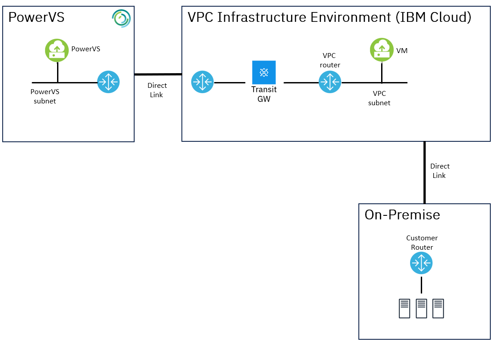
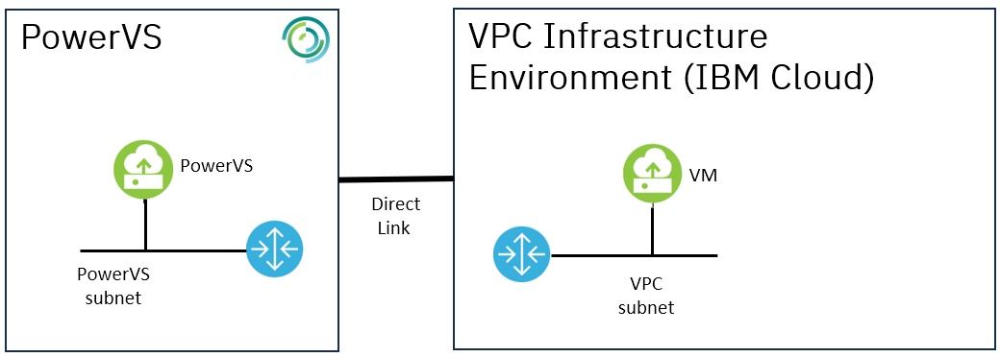

---

copyright:
  years: 2023
lastupdated: "2023-12-15"

subcollection: pattern-oracle-rac-on-powervs

keywords:

---

{{site.data.keyword.attribute-definition-list}}

# Network considerations
{: #network-considerations}

The Power Systems Virtual Servers uses software defined networking for creating subnets needed for Oracle RAC Public and Private networks. When deploying in a single zone, three networks subnets are needed, one for the Oracle RAC public network where RAC VIPs will be configured, and the other two for the Oracle RAC cluster interconnect. A Direct Link (2.0) service is required to connect the LPARs to on-premises networks and is also required to connect to VPC in IBM Cloud to leverage cloud services. Accounts that use an IBM Cloud Direct Link (2.0), must be VRF (Virtual Routing and Forwarding) enabled. A GRE tunnel will be needed from PowerVS to support Bring Your Own IP (BYOIP) and to enable routing to on-premise. Further details to manage network connections are at [Managing IBM Cloud connections](https://cloud.ibm.com/docs/power-iaas?topic=power-iaas-cloud-connections).

These are the typical scenarios

1.  **PowerVS connecting to On-Premise**

    Connecting Power Systems Virtual Server to on-premises network by using Direct Link (2.0) Connect. A typical use case for this topology is that the user requires access to the Power virtual servers from their on-premise networks.

    {: caption="Figure 1. On-Premise Connectivity" caption-side="bottom"}

2.  **PowerVS connecting to VPC in IBM Cloud**

    Connecting Power Systems Virtual Server to the IBM Cloud VPC infrastructure and cloud native services environment by using Direct Link (2.0) Connect. A typical use case for this topology is to use IBM Cloud VPC x86 resources as well as cloud native services like cloud object storage from PowerVS.

    {: caption="Figure 2. Connectivity to VPC" caption-side="bottom"}
