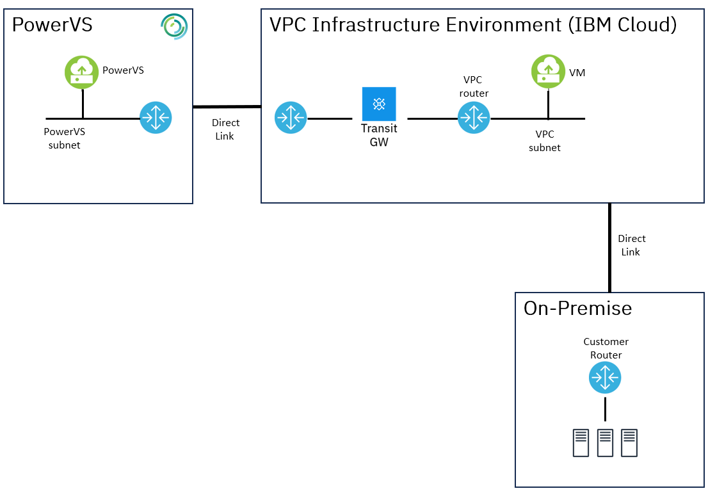
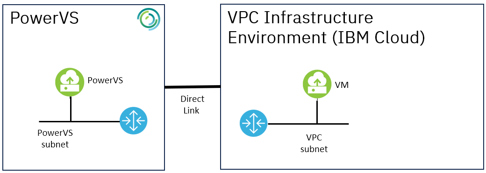

---

copyright:
  years: 2023, 2025
lastupdated: "2026-09-22"

subcollection: pattern-oracle-rac-on-powervs

keywords:

---

{{site.data.keyword.attribute-definition-list}}

# Network design
{: #network-design}

Power Systems Virtual Servers uses software-defined networking to create the subnets required for Oracle RAC public and private networks.
{: shortdesc}

When you deploy in a single zone, three network subnets are needed: one for the Oracle RAC public network where RAC VIPs are configured, and two for the Oracle RAC cluster interconnect.

## Power Edge Router
{: #network-per}

The **Power Edge Router (PER)** is the current standard architecture for connecting PowerVS workspaces to IBM Cloud services, VPC, and on-premises networks. PER is a high-performance router that creates a direct connection to the IBM Cloud Multi Protocol Label Switching (MPLS) backbone, providing the following benefits:

- Aggregate connectivity of **400 Gbps** to each PowerVS data center
- Direct access to IBM Cloud services (DNS, NTP, Cloud Object Storage) through a built-in NAT device, without the need for proxies or virtual routers
- Integration with IBM Cloud Transit Gateway for connectivity to VPC, Classic infrastructure, and remote PowerVS instances
- **No additional charge** for PER connectivity
- Support for **Network Security Groups (NSGs)** to define inbound security rules at the subnet and VSI level

New PowerVS workspaces are PER-enabled by default. If you have existing workspaces using the older Cloud Connections model, migrate to PER before 1 July 2025 to avoid metering charges on those connections. For migration instructions, see [Migrating to PER](/docs/power-iaas?topic=power-iaas-per-migration).

For more information, see [Getting started with the Power Edge Router](/docs/power-iaas?topic=power-iaas-per).

## Network Security Groups
{: #network-nsg}

In PER-enabled workspaces, you can define **Network Security Groups (NSGs)** to control inbound network traffic for Oracle RAC LPARs. NSGs let you create security rules based on source, destination, port, and protocol (TCP, UDP, ICMP). All outbound traffic is automatically allowed. NSGs are included at no additional cost and do not affect network throughput or latency.

NSGs are relevant to Oracle RAC deployments for enforcing network isolation between RAC nodes, the RAC public network, and the interconnect subnets. For more information, see [Network security groups](/docs/power-iaas?topic=power-iaas-nsg).

## Typical connectivity scenarios
{: #network-scenarios}

The following are typical connectivity scenarios for Oracle RAC on PowerVS:

1. PowerVS connecting to on-premises

   Connect Power Systems Virtual Server to an on-premises network by using Direct Link (2.0) Connect. A typical use case for this topology is that the user requires access to the Power virtual servers from their on-premises networks.

   {: caption="On-premises connectivity" caption-side="bottom"}

2. PowerVS connecting to VPC in IBM Cloud

   Connect Power Systems Virtual Server to the IBM Cloud VPC infrastructure and cloud-native services environment by using PER and Transit Gateway. A typical use case for this topology is to use IBM Cloud VPC x86 resources and cloud-native services such as Cloud Object Storage from PowerVS.

   {: caption="Connectivity to VPC" caption-side="bottom"}
