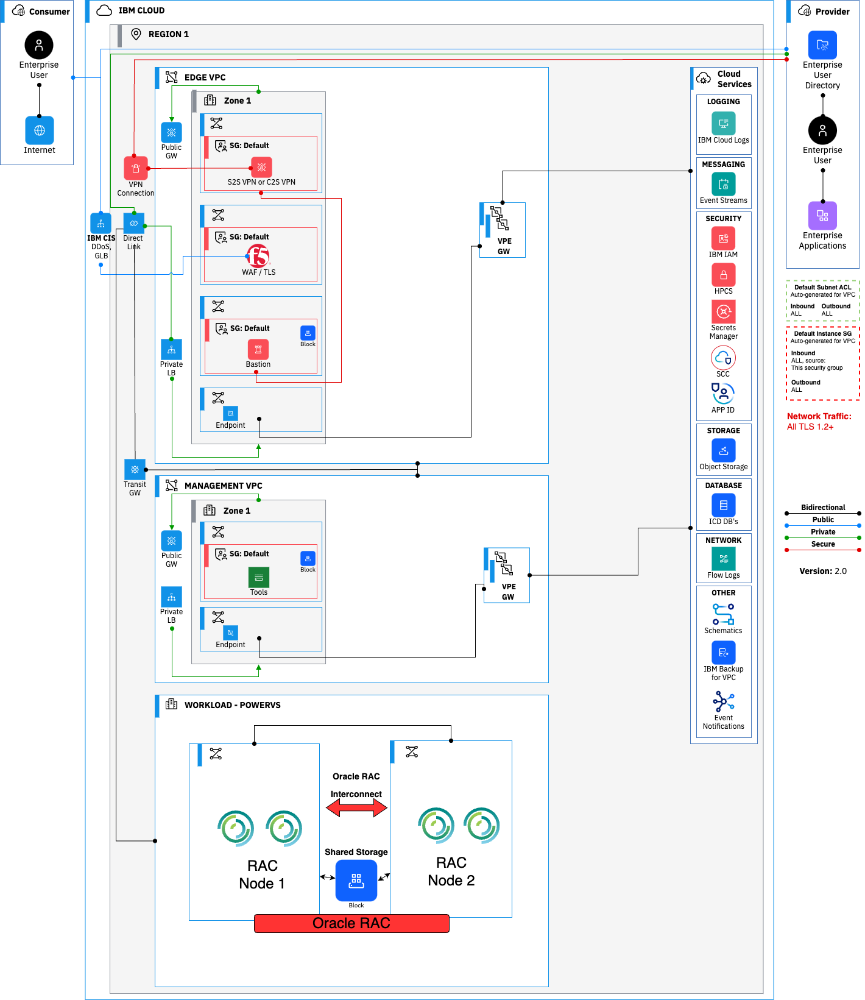
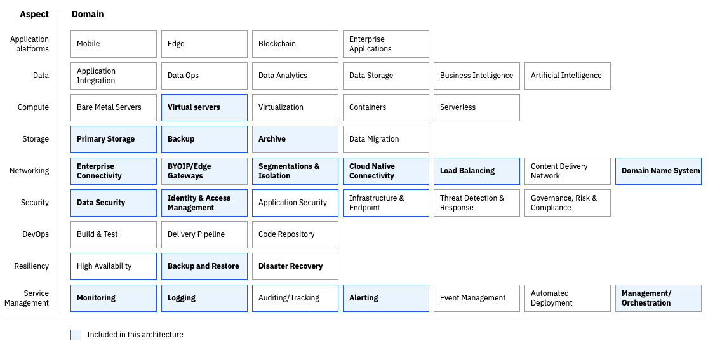

---

copyright:
  years: 2023
lastupdated: "2023-12-15"

subcollection: pattern-oracle-rac-on-powervs

keywords:
# The release that the reference architecture describes

authors:
  - name: Naeem Altaf

version: 1.0

deployment-url:

docs: https://cloud.ibm.com/docs/pattern-oracle-rac-on-powervs

content-type: reference-architecture

---

{{site.data.keyword.attribute-definition-list}}

# Oracle RAC on Power Virtual Server
{: #oracle-rac-on-powervs}
{: toc-content-type="reference-architecture"}
{: toc-version="1.0"}

The reference architecture for Oracle RAC, High Availability, in a single zone region, represents a solution, based on best practices and use-cases.

## Architecture diagram
{: #architecture-diagram}

{: caption="Figure 1. Solution Architecture" caption-side="bottom"}

The architecture diagram in Figure 1 illustrates a reference solution that has Power Virtual server environment and IBM Cloud VPC for an Oracle RAC deployment.

A Single Zone Region:

- VPC environment
   - Edge VPC: This landing zone hosts key security components that are needed in VPC and cloud management
   - Management VPC: This landing zone hosts all the management stack that is needed to manage the VPC and PowerVS environment

- PowerVS Environment
   - Workload PowerVS cluster: Oracle RAC

The solution component details include:

1. PowerVS systems are created in a PowerVS workspace. This workspace acts as a container for all PowerVS instances at a specific geographic region

2. For each Power Systems Virtual Server instance, a storage tier (Tier 1 or Tier 3) is selected. The storage tiers in Power Systems Virtual Server are based on I/O operations per second (IOPS)

3. The client network connectivity is accomplished from on-premises to IBM Cloud and PowerVS is setup through Direct Link (2.0) and Transit Gateway

4. An edge VPC is deployed which contains routing and security functions. It contains Bastion host, Firewalls providing advanced security functions

5. Managed VPC provides access to compute, storage, and network services to enable the application provider's administrators to monitor, operate, and maintain the environment. The intent is to completely isolate management operations from the VPC running consumer workloads

6. Public connectivity also routes through Cloud Internet services that can provide load balancing, failover, and DDoS services, then routes to the edge VPC

7. Virtual Private endpoints are used to provide connectivity to cloud native services from each VPC

8. Direct Link (2.0) and Transit Gateway are used to connect PowerVS environment the core workload hosting the Oracle RAC application and databases to a management VPC where various management tools can be deployed

9. Get visibility into the performance and health of your resources by configuring the [monitoring](/docs/power-iaas?topic=power-iaas-monitor-sysdig#sysdig-view-ui) and [Cloud Logs](/docs/cloud-logs), observability components

## Design scope
{: #design-scope}

Following the [Architecture Framework](/docs/architecture-framework?topic=architecture-framework-taxonomy), the Oracle RAC on Power Virtual Server covers design considerations and architecture decisions for the following aspects and domains:

- **Compute:** Power Systems Virtual Servers

- **Storage:** Primary Storage, Backup Storage

- **Networking:** Enterprise Connectivity, Segmentation, Cloud Native Connectivity, DNS

- **Security:** Data Security, Application Security, Infrastructure Security

- **Resiliency:** Backup

- **Service management:** Monitoring, Logging, Alerting, Management/Orchestration

{: caption="Figure 2. Oracle RAC on Power Virtual Server Architecture Design Scope" caption-side="bottom"}

The Architecture Framework provides a consistent approach to design cloud solutions by addressing requirements across a set of "aspects" and "domains", which are technology-agnostic architectural areas that need to be considered for any enterprise solution. See [Introduction to the architecture framework](/docs/architecture-framework?topic=architecture-framework-intro) for more details.

## Requirements
{: #requirements}

The following represents a baseline set of requirements that are applicable to most clients and critical to successful Oracle RAC on PowerVS deployment.

| Aspect                     | Requirement                                                                                                                                                                                                     |
|---------------------------------|----------------------------------------------------------------------------------------------------------------------------------------------------------------------------------------------------------------------------------------|
| Compute        | Provide different levels of cpu and memory options to match the type of workloads                                                                                                                                                      |
| Storage        | Provide different storage tier levels for type of workloads                                                                                                                                                                             |
| Network        | Enterprise connectivity to customer data centers to provide access to applications from on-premises                                                                                                                                      |
|                                 | Provide network isolation with the ability to separate applications based on attributes such as data classification, public versus internal apps and function                                                                             |
|                                 | Maintain IP addresses in the target (BYOIP)                                                                                                                                                                                            |
| Security       | Provide data encryption at rest                                                                                                                                                                                                        |
|                                 | IDS/IAM Services to target IBM PowerVS environment                                                                                                                                                                                     |
|                                 | Firewalls must be restrictively configured to provide advanced security features and prevent all traffic, both inbound and outbound, except that which is specifically required, documented, and approved and include IPS/IDS services |
| Resiliency     | Multi-Region capability to support disaster recovery strategy and solution that allows all production applications to be included by using cloud infrastructure DR capabilities                                                      |
|                                 | RTO/RPO = 4 hours/15 minutes; rollback to original environments should occur no later than specified RTOs                                                                                                                              |
|                                 | Provide backup for Infrastructure components and Database that are hosted in the cloud environment.                                                                                                                                             |
| Service management  | Provide Health and System Monitoring with ability to monitor and correlate performance metrics and events and provide alerting across applications and infrastructure                                                                  |
|                                 | Ability to diagnose issues and exceptions and identify error source                                                                                                                                                                    |
|                                 | Automate management processes to keep applications and infrastructure secure, up to date, and available                                                                                                                                |
{: caption="Table 1. Requirements" caption-side="bottom"}

## Components
{: #components}

| Aspect       | Component                                                                                                                    | How the component is used                                                                                    |
|-------------------|--------------------------------------------------------------------------------------------------------------------------------------------|-------------------------------------------------------------------------------------------------------------------|
| Compute       | [PowerVS](/docs/power-iaas?topic=power-iaas-getting-started)                                                          | Web, App, and database servers                                                                                    |
| Storage       | [PowerVS Storage](/docs/openshift?topic=openshift-vpc-block)                                                          | Database servers shared storage for RAC                                                                           |
|                   | [VPC Block Storage](/docs/vpc?topic=vpc-block-storage-about&interface=ui#block-storage-overview)                      | Web app storage if needed                                                                                         |
|                   | [VPC File Storage](/docs/vpc?topic=vpc-file-storage-vpc-about&interface=ui)                                           | Web app shared storage if needed                                                                                  |
|                   | [Cloud Object Storage](/docs/cloud-object-storage?topic=cloud-object-storage-getting-started-cloud-object-storage)    | Web app static content, backups, logs for short and long-term retention (application, operational, and audit logs) |
| Networking   | [VPC Virtual Private Network (VPN)](/docs/iaas-vpn?topic=iaas-vpn-getting-started)                                    | Remote access to manage resources in a private network                                                              |
|                   | [Virtual Private Gateway & Virtual Private Endpoint (VPE)](/docs/vpc?topic=vpc-about-vpe)                             | For private network access to Cloud Services, for example, Key Protect, Cloud Object Storage, and so on.                                        |
|                   | [VPC Load Balancers](/docs/vpc?topic=vpc-load-balancers)                                                              | Application Load Balancing for web servers, app servers, and database servers                                     |
|                   | [Public Gateway](/docs/vpc?topic=vpc-about-public-gateways&interface=ui)                                              | For web server access to the internet                                                                             |
|                   | [Cloud Internet Services (CIS)](/docs/cis?topic=cis-getting-started)                                                  | Public Load balancing of web server traffic across zones in the region                                           |
|                   | [DNS Services](/docs/dns-svcs?topic=dns-svcs-about-dns-services)                                                      | The domain Name System (DNS) to associate human-friendly domain names with IP addresses                               |
| Security      | [IAM](/docs/account?topic=account-cloudaccess)                                                                        | IBM Cloud Identity & Access Management                                                                            |
|                   | [Bastion Host on VPC VSI](/docs/solution-tutorials?topic=solution-tutorials-vpc-secure-management-bastion-server) | Remote access with Privileged Access Management                                                                   |
|                   | [Virtual Private Clouds (VPCs), Subnets, Security Groups, ACLs](/docs/vpc?topic=vpc-getting-started)                  | Core Network Protection for web, app, and database tiers                                                          |
|                   | [Cloud Internet Services (CIS)](/docs/cis?topic=cis-getting-started)                                                  | DDoS protection and Web App Firewall                                                                              |
|                   | [Key Protect](/docs/key-protect) or [HPCS](/docs/hs-crypto?topic=hs-crypto-get-started)          | Hardware security module (HSM) and Key Management Service                                                         |
|                   | [Secrets Manager](/docs/secrets-manager)                                                                              | Certificate and Secrets Management                                                                                |
| **Resiliency**    | [PowerVS](/docs/power-iaas?topic=power-iaas-getting-started)                                                          | Multiple PowerVS on separate physical servers with VM and Storage anti-affinity policy                            |
| Service management | [IBM Cloud Monitoring](/docs/monitoring?topic=monitoring-about-monitor)                                               | Apps and operational monitoring                                                                                   |
|                   | [IBM Cloud Logs](/docs/cloud-logs?topic=cloud-logs-about-cl)                                             | Apps and operational logs, Audit Logs                                                                                         |
{: caption="Table 2. Components" caption-side="bottom"}
