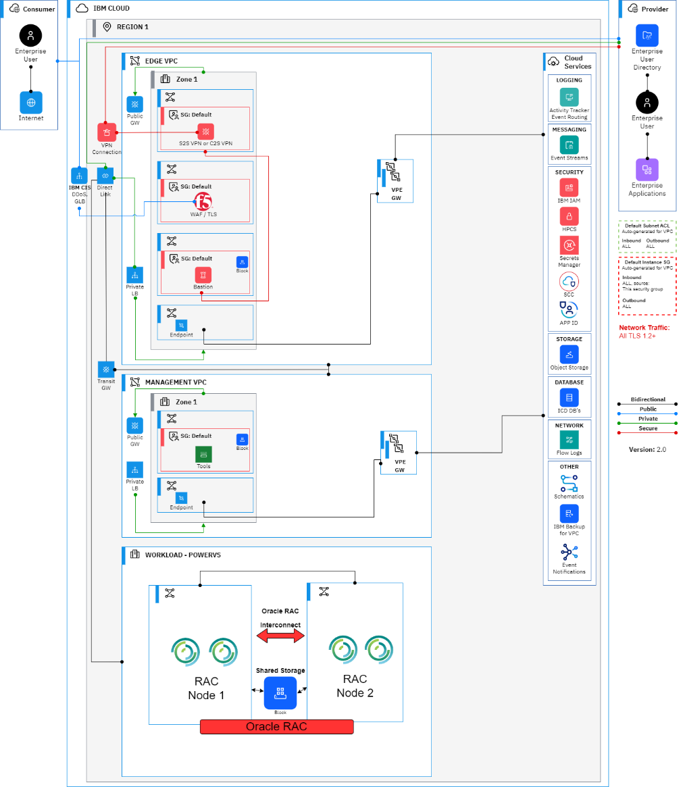

---

copyright:
  years: 2023
lastupdated: "2023-11-28"

subcollection: pattern-oracle-rac-on-powervs

keywords:

---

{{site.data.keyword.attribute-definition-list}}

# Architecture
{: #architecture}

A reference architecture for Oracle RAC, High Availability, in a single zone region, represents a particular solution, based on best practices and use-cases.

The architecture below lists a reference solution which has Power Virtual server environment and IBM Cloud VPC with the following components.

A Single Zone Region:

-   VPC environment

    -   Edge VPC: This landing zone hosts key security solution components needed in VPC and cloud management

    -   Management VPC: This landing zone hosts all the management stack needed to manage VPC and PowerVS environment

-   PowerVS Environment

    -   Workload PowerVS cluster: Oracle RAC

Here are the solution component details

1.  PowerVS systems are created in a PowerVS workspace. This workspace acts as a container for all PowerVS instances at a specific geographic region

2.  For each Power Systems Virtual Server instance, a storage tier (Tier 1 or Tier 3) is selected. The storage tiers in Power Systems Virtual Server are based on I/O operations per second (IOPS)

3.  The client network connectivity is accomplished from on-premise to IBM Cloud and PowerVS is setup through Direct Link (2.0) and Transit Gateway

4.  An edge VPC is deployed which contains routing and security function. It contains Bastion host, Firewalls providing advanced security functions

5.  Managed VPC provides access to compute, storage, and network services to enable the application provider's administrators to monitor, operate, and maintain the environment. The intent is to completely isolate management operations from the VPC running consumer workloads

6.  Public connectivity also routes through Cloud Internet services which can provide load balancing, failover, and DDoS services, then routes to the edge VPC

7.  Virtual Private endpoints are used to provide connectivity to cloud native services from each VPC

8.  Direct Link (2.0) and Transit Gateway is used to connect PowerVS environment the core workload hosting the Oracle RAC application and database(s) to a management VPC where various management tools can be deployed

9.  Get visibility into the performance and health of your resources by configuring the [monitoring](https://cloud.ibm.com/docs/power-iaas?topic=power-iaas-monitor-sysdig#sysdig-view-ui) and [activity tracker](https://cloud.ibm.com/docs/power-iaas?topic=power-iaas-at-events), observability components

Solution Architecture Diagram

{: caption="Figure 1. Solution Architecture" caption-side="bottom"}

Solution Components

| **Aspect**       | **Component**                                                                                                                    | **How it is used in solution**                                                                                    |
|-------------------|--------------------------------------------------------------------------------------------------------------------------------------------|-------------------------------------------------------------------------------------------------------------------|
| **Compute**       | [PowerVS](https://cloud.ibm.com/docs/power-iaas?topic=power-iaas-getting-started)                                                          | Web, App, and database servers                                                                                    |
| **Storage**       | [PowerVS Storage](https://cloud.ibm.com/docs/openshift?topic=openshift-vpc-block)                                                          | Database servers shared storage for RAC                                                                           |
|                   | [VPC Block Storage](https://cloud.ibm.com/docs/vpc?topic=vpc-block-storage-about&interface=ui#block-storage-overview)                      | Web app storage if needed                                                                                         |
|                   | [VPC File Storage](https://cloud.ibm.com/docs/vpc?topic=vpc-file-storage-vpc-about&interface=ui)                                           | Web app shared storage if needed                                                                                  |
|                   | [Cloud Object Storage](https://cloud.ibm.com/docs/cloud-object-storage?topic=cloud-object-storage-getting-started-cloud-object-storage)    | Web app static content, backups, logs for short and long-term retention (application, operational and audit logs) |
| **Networking**    | [VPC Virtual Private Network (VPN)](https://cloud.ibm.com/docs/iaas-vpn?topic=iaas-vpn-getting-started)                                    | Remote access to manage resources in private network                                                              |
|                   | [Virtual Private Gateway & Virtual Private Endpoint (VPE)](https://cloud.ibm.com/docs/vpc?topic=vpc-about-vpe)                             | For private network access to Cloud Services, e.g., Key Protect, COS, etc.                                        |
|                   | [VPC Load Balancers](https://cloud.ibm.com/docs/vpc?topic=vpc-load-balancers)                                                              | Application Load Balancing for web servers, app servers, and database servers                                     |
|                   | [Public Gateway](https://cloud.ibm.com/docs/vpc?topic=vpc-about-public-gateways&interface=ui)                                              | For web server access to the internet                                                                             |
|                   | [Cloud Internet Services (CIS)](https://cloud.ibm.com/docs/cis?topic=cis-getting-started)                                                  | Public Load balancing of web servers traffic across zones in the region                                           |
|                   | [DNS Services](https://cloud.ibm.com/docs/dns-svcs?topic=dns-svcs-about-dns-services)                                                      | Domain Name System (DNS) to associate human-friendly domain names with IP addresses                               |
| **Security**      | [IAM](https://cloud.ibm.com/docs/account?topic=account-cloudaccess)                                                                        | IBM Cloud Identity & Access Management                                                                            |
|                   | [BYO Bastion Host on VPC VSI](https://cloud.ibm.com/docs/solution-tutorials?topic=solution-tutorials-vpc-secure-management-bastion-server) | Remote access with Privileged Access Management                                                                   |
|                   | [Virtual Private Clouds (VPCs), Subnets, Security Groups, ACLs](https://cloud.ibm.com/docs/vpc?topic=vpc-getting-started)                  | Core Network Protection for web, app, and database tiers                                                          |
|                   | [Cloud Internet Services (CIS)](https://cloud.ibm.com/docs/cis?topic=cis-getting-started)                                                  | DDoS protection and Web App Firewall                                                                              |
|                   | [Key protect](https://cloud.ibm.com/docs/key-protect) or [HPCS](https://cloud.ibm.com/docs/hs-crypto?topic=hs-crypto-get-started)          | Hardware security module (HSM) and Key Management Service                                                         |
|                   | [Secrets Manager](https://cloud.ibm.com/docs/secrets-manager)                                                                              | Certificate and Secrets Management                                                                                |
| **Resiliency**    | [PowerVS](https://cloud.ibm.com/docs/power-iaas?topic=power-iaas-getting-started)                                                          | Multiple PowerVS on separate physical servers with VM and Storage anti-affinity policy                            |
| **Observability** | [IBM Cloud Monitoring](https://cloud.ibm.com/docs/monitoring?topic=monitoring-about-monitor)                                               | Apps and operational monitoring                                                                                   |
|                   | [IBM Log Analysis](https://cloud.ibm.com/docs/log-analysis?topic=log-analysis-getting-started)                                             | Apps and operational logs                                                                                         |
|                   | [Activity Tracker Event Routing](https://cloud.ibm.com/docs/atracker?topic=atracker-about)                                                 | Audit logs                                                                                                        |
{: caption="Table 3. Solution Components" caption-side="bottom"}
