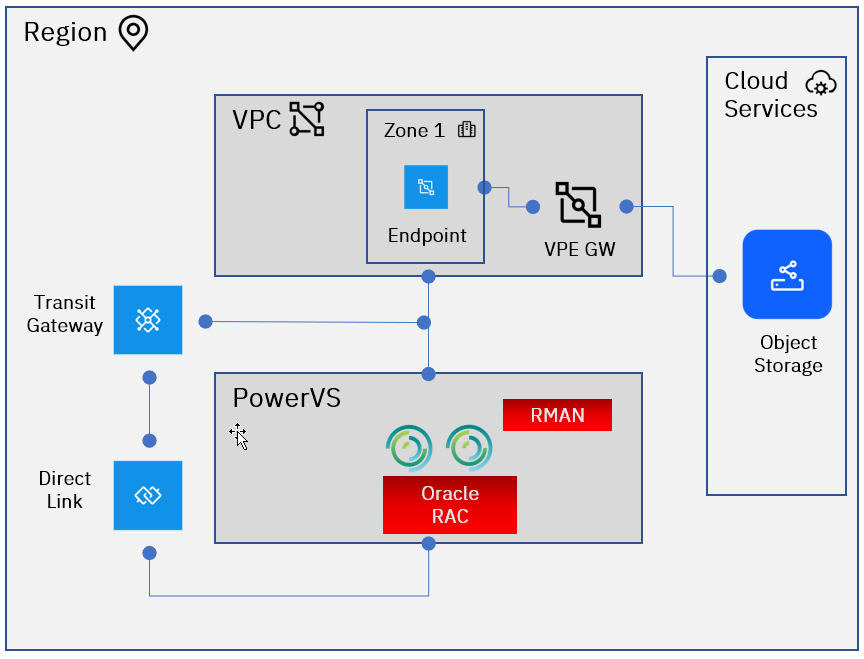

---

copyright:
  years: 2023
lastupdated: "2023-11-28"

subcollection: pattern-oracle-rac-on-powervs

keywords:

---

{{site.data.keyword.attribute-definition-list}}

# Resiliency considerations
{: #resiliency-considerations}

Database resiliency refers to the ability of a database system to continue functioning correctly and efficiently in the face of various challenges, such as hardware failures, software bugs, human errors, or malicious attacks. For Oracle Database, resiliency encompasses several key aspects:

**High Availability (HA):** Oracle Real Application Clusters (RAC) to ensure that the database remains available even in the event of single node failure

**Backup and Recovery:** Oracle Recovery Manager (RMAN) and other backup solutions allow for regular backups of the database, ensuring that data can be recovered in case of corruption or data loss due to systems or end users

**Disaster Recovery (DR):** Oracle Data Guard and other DR solutions help in protecting the database against site-wide failures, such as natural disasters, by maintaining standby databases in geographically separate locations. Disaster Recovery is covered by the “Oracle Disaster Recovery on Power Virtual Server”

Oracle Real Application Clusters (RAC) is a clustered version of Oracle Database, which provides high availability and scalability. Backup and restore operations for Oracle RAC are crucial to ensure data integrity and availability. Disaster Recovery for Oracle RAC involves strategies to ensure the availability and integrity of the database in the event of a failure, disaster, or other disruptions.

By understanding the unique capabilities of Oracle RAC, organizations with proper planning can plan for their data to be safe and recoverable. For Backup & Restore there’s a seamless integration with Oracle Recovery Manager (RMAN) to direct database backup and restore activity to IBM Cloud Object Storage. Additional information is located at [IBM Cloud Object Storage
for Oracle RMAN Backup](https://www.ibm.com/downloads/cas/O0BZVBPN).
Recovery Manager (RMAN) is the native Oracle Database client that performs backup and recovery tasks for local and clustered databases and automates administration of configured backup strategies. RMAN has Oracle’s Secure Backup (OSB) cloud module with an SBT (Secure Backup) interface that enables the use of the S3 protocol for data backup to IBM Cloud Object Storage. OSB will need to be installed on both Oracle RAC nodes and may have licensing impacts.

Backup considerations include deciding on how often a full database backup and an incremental backup is taken. A full backup captures the entire database, while an incremental backup captures only the changes since the last backup. For example, the customer may implement a weekly full backup and daily incremental backup for Oracle DB. These requirements are strictly determined by the customer based on their business needs. For Database level, RMAN tool is recommended for backup.

| **Oracle Database** |           |           |
|---------------------|-----------|-----------|
| Backup              | Frequency | Retention |
| Full                | Weekly    | 5 Weeks   |
| Incremental         | Daily     | 30 Days   |
{: caption="Table 1. Database Backup and Retention Recommendations" caption-side="bottom"}

For OS level, Veeam is recommended for backup. Veeam Agents for IBM AIX provide capabilities to backup and back up specific directories with files or individual files.

| **OS & File Systems** |           |           |
|-----------------------|-----------|-----------|
| Backup                | Frequency | Retention |
| Full                  | Monthly   | 60 Days   |
| Incremental           | Daily     | 60 Days   |
{: caption="Table 2. OS Backup and Retention Recommendations" caption-side="bottom"}
