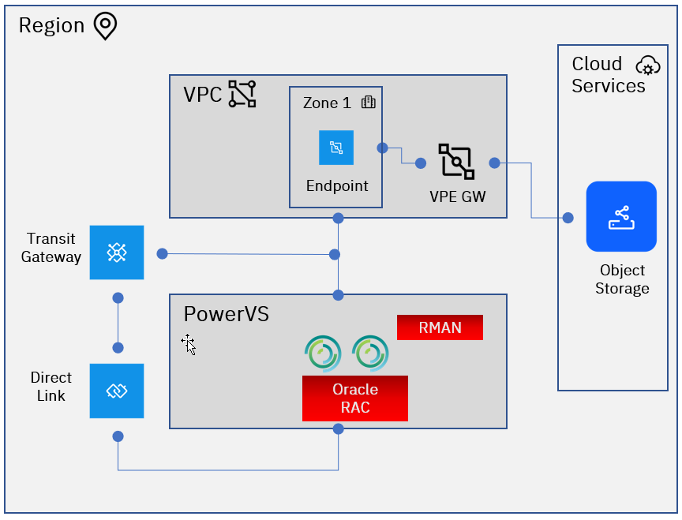

---

copyright:
  years: 2023, 2025
lastupdated: "2026-09-22"

subcollection: pattern-oracle-rac-on-powervs

keywords:

---

{{site.data.keyword.attribute-definition-list}}

# Resiliency design
{: #resiliency-design}

Database resiliency refers to the ability of a database system to continue functioning correctly and efficiently in the face of various challenges, such as hardware failures, software bugs, human errors, or malicious attacks.
{: shortdesc}

For Oracle Database, resiliency encompasses several key aspects:

High availability
:   Oracle Real Application Clusters (RAC) ensures that the database remains available even if a single node failure occurs.

Backup and recovery
:   Oracle Recovery Manager (RMAN) and other backup solutions allow for regular backups of the database. Regular backups ensure that data can be recovered if there is corruption or data loss due to systems or users.

Disaster recovery
:   Oracle Data Guard and other DR solutions help protect the database against site-wide failures, such as natural disasters, by maintaining standby databases in geographically separate locations. Disaster recovery is covered by the "Oracle Disaster Recovery on Power Virtual Server" pattern.

Oracle Real Application Clusters (RAC) is a clustered version of Oracle Database that provides high availability and scalability. Backup and restore operations for Oracle RAC are crucial to ensure data integrity and availability. Disaster recovery for Oracle RAC involves strategies to ensure the availability and integrity of the database if a failure, disaster, or other disruption occurs.

{: caption="Disaster recovery for Oracle RAC" caption-side="bottom"}

## Database backup
{: #resiliency-db-backup}

By understanding the unique capabilities of Oracle RAC, organizations can plan for their data to be safe and recoverable. For backup and restore, there is a seamless integration with Oracle Recovery Manager (RMAN) to direct database backup and restore activity to IBM Cloud Object Storage. Recovery Manager (RMAN) is the native Oracle Database client that performs backup and recovery tasks for local and clustered databases and automates administration of configured backup strategies. RMAN uses Oracle's Secure Backup (OSB) cloud module with an SBT (Secure Backup) interface that enables the S3 protocol for data backup to IBM Cloud Object Storage. OSB needs to be installed on both Oracle RAC nodes and might have licensing impacts.

Backup considerations include deciding how often a full database backup and an incremental backup are taken. A full backup captures the entire database, while an incremental backup captures only the changes since the last backup. For example, a customer might implement a weekly full backup and daily incremental backup for Oracle DB. These requirements are determined by the customer based on their business needs. For the database level, the RMAN tool is recommended for backup.

| Oracle Database | Frequency | Retention |
|---|---|---|
| Full backup | Weekly | 5 weeks |
| Incremental backup | Daily | 30 days |
{: caption="Database backup and retention recommendations" caption-side="bottom"}

## OS and file system backup
{: #resiliency-os-backup}

For the OS level, IBM Storage Protect or Veeam can be used for backup. IBM Storage Protect can be deployed on an AIX LPAR in PowerVS or on an IBM Cloud VPC instance. Veeam Agents for IBM AIX provide capabilities to back up specific directories, files, or individual files.

A new fully managed backup-as-a-service option is also available: **Secure Automated Backup with Compass for PowerVS**, provided by IBM Cloud Partner Cobalt Iron. This service is available directly from the [IBM Cloud catalog](https://cloud.ibm.com/catalog){: external} and supports AIX, Linux, and IBM i workloads. It is available in both single-copy (within one data center) and dual-copy (across two regional data centers) configurations and is billed monthly based on stored data after deduplication and compression. For more information, see [Backup for IBM data center workloads](/docs/power-iaas?topic=power-iaas-backup-strategies).

| OS and file systems | Frequency | Retention |
|---|---|---|
| Full backup | Monthly | 60 days |
| Incremental backup | Daily | 60 days |
{: caption="OS backup and retention recommendations" caption-side="bottom"}

## Platform-level storage replication
{: #resiliency-grs}

IBM Power Virtual Server supports **Global Replication Services (GRS)**, which provides volume replication based on IBM FlashSystem Global Mirror Change Volume (GMCV) technology. GRS enables asynchronous replication of storage volumes between paired IBM Cloud regional data centers without requiring a dedicated replication network. GRS provides the infrastructure foundation for building disaster recovery solutions that complement Oracle Data Guard.

Key benefits of GRS include:

- Maintains a consistent and recoverable copy of data at a secondary location with minimal impact to applications at the primary location
- Fixed data center pair mappings support predictable failover and failback
- Reduces time required to return to the primary location after an outage

For more information, see [IBM Power Virtual Server Global Replication Services](/docs/power-iaas?topic=power-iaas-getting-started-GRS).
